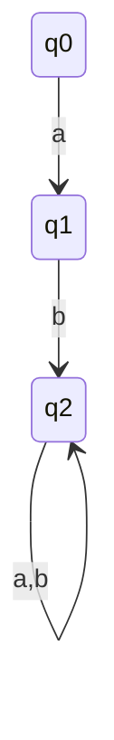

# yuge テーマ レイアウト規約集

class-slides スキルで生成する Marp スライドは `theme: yuge` 固定。CSS 本体はリポジトリ外で管理されるため、ここではテーマが提供するクラス・HTML 構造を利用する規約を定義する。

## 1. 必須フロントマッター

すべてのスライドファイルは以下のフロントマッターで始める:

```yaml
---
marp: true
theme: yuge
paginate: true
header: '<学校名> <学科> <科目名> <年度>講義資料'
footer: ''
math: mathjax
---
```

- `header` はシラバス基本情報から `'弓削商船高等専門学校 <学科> <科目名> <年度>講義資料'` の形式で構築する
- `footer` は常に空文字列
- 数式を含まない回でも `math: mathjax` は固定で入れる（統一のため）

## 2. スライドレイアウト ディレクティブ

スライドごとに `<!-- class: ... -->` で指定する:

| ディレクティブ | 用途 |
|--------------|------|
| `<!-- class: flex-layout -->` | 標準の flex レイアウト。縦方向に中央揃えになる |
| `<!-- class: flex-layout natural-height -->` | コンテンツの高さに応じて伸びる。表・長い箇条書き・mermaid コードベタ貼りを含むスライドで使う |

省略した場合はテーマデフォルト。タイトルのみのスライド（章区切り）はディレクティブなしでよい。

コメント記法の注意: `<!--` と `-->` の間に改行を入れて `class:` を独立行で書く形式でもよい（参考リポの慣用）:

```markdown
<!--
class: flex-layout natural-height
-->
```

## 3. 2カラム構造

```html
<div class="columns">

<div>

左カラムの内容（Markdown で書ける）

</div>

<div>

右カラムの内容

</div>

</div>
```

- 比較・補足・対応関係を示すスライドで頻繁に使う
- カラム数は2が基本。3カラム以上はテーマ未対応
- ネストは原則避ける（メンテ困難）。ただし2カラム内のさらに2分割が必要な場合のみ許容
- **表紙スライド（科目タイトル + 回タイトルを掲げる1枚目）では2カラム構造を使わない**。科目名・回タイトル・今回の提出物等はすべて全幅で縦積みにする。理由: 科目名+「講義資料」等の長いタイトルがカラム幅に収まらず改行されて見栄えが崩れるため

## 4. Tips・補足囲み

```html
<div class="summary-positive">

## Tips

補足内容

</div>
```

- 本筋の補足情報、深掘り Tips、用語解説などに使う
- Warning 類には使わない（専用クラスなし）

## 5. 図の描画

図的情報は **箇条書き・表・インライン記号** で表現する（§5-1）。箇条書き・表で表現困難な複雑図のみ mermaid コードをコードブロックでベタ貼りする（§5-2）。写真・イラストは挿入しない（画像はスコープ外）。

### 5-1. テキスト表現テンプレート

**順序フロー（インライン）**: 工程・手順を1行に並べる。

```markdown
字句解析 → 構文解析 → 意味解析 → コード生成
```

**段階フロー（説明付き）**: 各工程の役割を併記する。番号付きリストで書く。

```markdown
1. **字句解析** — ソースをトークン列に分解
2. **構文解析** — トークン列から構文木を構築
3. **意味解析** — 型・スコープを検証
4. **コード生成** — 中間表現を目的コードに変換
```

**対応関係**: Markdown 表で書く。

```markdown
| 入力 | 処理 | 出力 |
|------|------|------|
| ソース文字列 | 字句解析 | トークン列 |
| トークン列 | 構文解析 | 構文木 |
```

**階層構造**: 入れ子箇条書きで書く。

```markdown
- プロジェクト
  - src
    - main.c
    - util.c
  - tests
    - test_main.c
```

**分岐**: 文章 + 箇条書きで条件と結果を示す。

```markdown
入力トークンが **識別子** なら:
- シンボルテーブルを参照
- 未定義なら新規登録、既存なら参照解決

入力トークンが **キーワード** なら:
- 構文ルールに従って状態遷移
```

利用できるインライン記号: `→ ⇒ ▶ ▼ ⇄ ⇆ ↔ ⟶`。半角矢印 `->` `=>` `<-` も可（コードブロック内では特に推奨）。

### 5-2. mermaid コードベタ貼り（複雑図用）

箇条書き・表で表現困難な複雑図（シーケンス・多分岐の状態遷移・クラス図・ER 図等）は、mermaid コードを **コードブロックとしてベタ貼り**する。Marp 上ではコードがそのままテキスト表示されるため、学生は Mermaid Viewer でレンダリングして閲覧する運用とする。

スライド構成:

````markdown
<!--
class: flex-layout natural-height
-->

# DFA の状態遷移

- 状態 q0/q1/q2 と入力 a/b による遷移
- 受理状態は q2

下記の mermaid コードを Mermaid Viewer（<https://mermaid.live>）に貼り付けると図として確認できます。


````

ルール:

- レイアウトは `<!-- class: flex-layout natural-height -->` を必ず指定する（コードブロックが長くても収まるように）
- 説明箇条書き（図の概要 2〜4 行）→ Viewer 案内文 → コードブロックの順で構成する
- Viewer URL は `https://mermaid.live` を既定とする
- 1スライド1図。複数図を1枚に詰めない

## 6. 数式

インライン数式は `$...$`、ブロック数式は `$$...$$` で記述する。`math: mathjax` がフロントマッターにあるため追加設定不要。

## 7. スタイル上書き（scoped）

表の着色など、スライド固有のスタイル調整は `<style scoped>` で書く:

```html
<style scoped>
table td:nth-child(2) { background-color: #e8f5e8; }
table td:nth-child(3) { background-color: #ffebee; }
</style>
```

- スコープは当該スライドのみ
- グローバルな見た目はテーマ任せ（ここでは触らない）

## 8. スライド区切り

`---` を単独行で書く（前後に空行を入れる）。Marp 仕様準拠。

## 9. フォントサイズの部分調整

原則としてフォントサイズはテーマ任せ（section=26px / h1=40px / h2=32px / h3=26px）。特定スライドでのみどうしても情報量の都合で縮小が必要な場合に限り `<div style="font-size: ...;">` でインライン指定する。安易に使わない。
