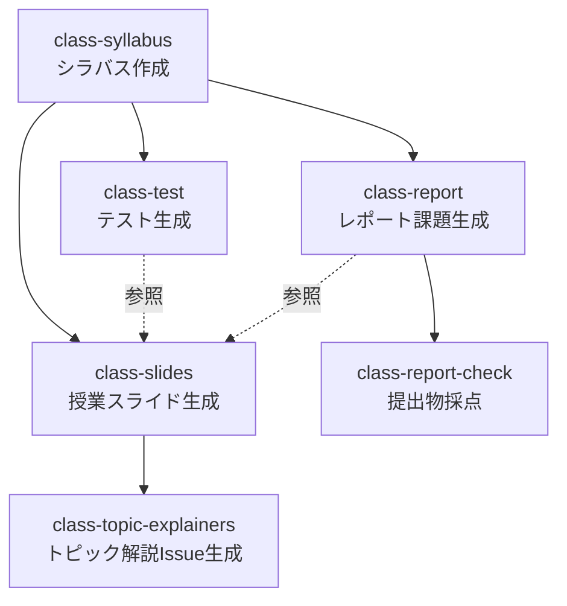

# NITYC-MCC-Tools

弓削商船高等専門学校（NITYC）の教育業務を支援するClaude Codeスキル集。高専モデルコアカリキュラム（MCC）に基づく情報系分野（V-D）の参照資料とスキルを提供する。

## 概要

- MCCに基づいたシラバス作成を支援
- 情報系分野（プログラミング、ソフトウェア、計算機工学、ネットワーク等）に対応
- テスト問題の自動生成とMoodle XMLでの出力を支援
- レポート・成果物課題の生成と自動採点を支援
- シラバスから授業用Marpスライドを生成
- スライドから節単位のトピック解説ドキュメント（GitHub Issue）を生成

## 含まれるファイル

| ファイル/フォルダ | 説明 |
|------------------|------|
| `docs/Kosen-MCC2023-Tech.pdf` | MCC2023原本 |
| `.claude/skills/class-syllabus/` | シラバス作成スキル |
| `.claude/skills/class-test/` | テスト問題生成スキル |
| `.claude/skills/class-report/` | レポート課題生成スキル |
| `.claude/skills/class-report-check/` | レポート採点スキル |
| `.claude/skills/class-slides/` | 授業用Marpスライド生成スキル |
| `.claude/skills/class-topic-explainers/` | スライドから節単位のトピック解説Issue生成スキル |
| `CLAUDE.md` | Claude Code用の指示ファイル |

## セットアップ

`./bootstrap.sh` を実行すると依存チェック・Python パッケージ導入・テーマリポジトリ取得・gh 認証確認を行う。`--minimal` で slides 関連をスキップ、`--help` で使い方表示。

手動で入れるもの:

- [Python 3](https://www.python.org/) — ランタイム
  - [openpyxl](https://openpyxl.readthedocs.io/) — シラバス Excel 操作（bootstrap.sh が pip install --user）
- [Node.js](https://nodejs.org/) — ランタイム
  - [@marp-team/marp-cli](https://github.com/marp-team/marp-cli) — Marp スライドの PDF 変換（npx で都度実行）
- [GitHub CLI (`gh`)](https://cli.github.com/) — Issue 作成・認証
- [Google Chrome](https://www.google.com/chrome/) — Marp の PDF レンダリング

## スキルの実行順序・ユースケース

正規フローは `syllabus → test & report → slides → topic-explainers & report-check`。

**どこから始めるか**:

- **新規科目を立ち上げる**: `class-syllabus` から入る（シラバス作成 → 以降の運用フローへ）
- **既存シラバスを流用する**: 目的に応じて `class-test` / `class-report` / `class-slides` から直接入る
  - いずれのエントリーでも、初回実行時に `class-syllabus-parse`（シラバス解析の共通前処理）が後続スキルから自動案内される
- **スライドから Issue 形式の解説ドキュメントを立ち上げる**: `class-slides` で生成したスライド MD がある状態で `class-topic-explainers` を実行する

補足:

- `class-slides` は提出物該当回の詳細化に `class-test` `class-report` の出力を参照する（点線）。必要なら slides より先にこれらを実行しておく。
- `class-slides` の PDF エクスポートは本リポジトリの親ディレクトリにある [marp-theme-nityc](https://github.com/atsuki-seo/marp-theme-nityc)（別リポジトリ、yuge テーマの CSS を提供）を参照する。未取得の場合は `../marp-theme-nityc/` に自動 clone する（`git@github.com:atsuki-seo/marp-theme-nityc.git`、SSH 鍵とネットワークが必要）。PDF 生成はデフォルト有効で、スキル実行中にスキップ可能。
- `class-report-check` は `class-report` で生成した課題・ルーブリックを正本として採点する。
- `class-topic-explainers` は `class-slides` の成果物（`output/YYYY_[教科]/slides/classNN.md`）を一次入力として GitHub Issue を立てる。先に `class-slides` を実行しておく必要がある。Issue 作成先はカレント Git リポジトリ（`gh` 認証済み・Issue 機能有効であること）。マッピングは教科ディレクトリ直下の `issues-map.yml` で管理し、git の差分に含める。
- `class-syllabus-parse` はセッション冒頭で明示実行しておく。`class-test` と `class-report` を連続で叩くと compacting により parse 情報が劣化する可能性があるため、重い生成スキルはセッションを分けて都度 parse からやり直す。

## 出典

- [高専機構 モデルコアカリキュラム（令和5年度版）](https://kosen-k.go.jp/wp/wp-content/uploads/2023/12/2c383e29-7e20-4b20-af19-ca3737450665.pdf)
