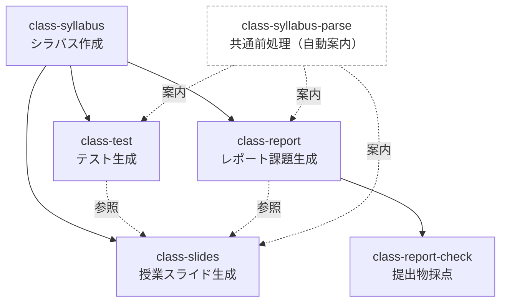

# NITYC-MCC-Tools

弓削商船高等専門学校（NITYC）の教育業務を支援するClaude Codeスキル集。高専モデルコアカリキュラム（MCC）に基づく情報系分野（V-D）の参照資料とスキルを提供する。

## 概要

- MCCに基づいたシラバス作成を支援
- 情報系分野（プログラミング、ソフトウェア、計算機工学、ネットワーク等）に対応
- テスト問題の自動生成とMoodle XMLでの出力を支援
- レポート・成果物課題の生成と自動採点を支援
- シラバスから授業用Marpスライドを生成

## 含まれるファイル

| ファイル/フォルダ | 説明 |
|------------------|------|
| `docs/Kosen-MCC2023-Tech.pdf` | MCC2023原本 |
| `.claude/skills/class-syllabus/` | シラバス作成スキル |
| `.claude/skills/class-test/` | テスト問題生成スキル |
| `.claude/skills/class-report/` | レポート課題生成スキル |
| `.claude/skills/class-report-check/` | レポート採点スキル |
| `.claude/skills/class-slides/` | 授業用Marpスライド生成スキル |
| `CLAUDE.md` | Claude Code用の指示ファイル |

## スキルの実行順序・ユースケース

正規フローは `syllabus → test & report → slides → report-check`。

**どこから始めるか**:

- **新規科目を立ち上げる**: `class-syllabus` から入る（シラバス作成 → 以降の運用フローへ）
- **既存シラバスを流用する**: 目的に応じて `class-test` / `class-report` / `class-slides` から直接入る

補足:

- `class-syllabus-parse` は後続スキル（`class-test` / `class-report` / `class-slides`）が未解析時に事前実行を案内する**共通前処理**。ユーザーが直接呼ぶエントリーではなく、後続スキルから案内される。複数スキルを連続利用する場合は先に `/class-syllabus-parse` を1回実行しておくとコンテキスト再利用で効率化できる。
- `class-slides` は提出物該当回の詳細化に `class-test` `class-report` の出力を参照する（点線）。必要なら slides より先にこれらを実行しておく。
- `class-report-check` は `class-report` で生成した課題・ルーブリックを正本として採点する。

## 出典

- [高専機構 モデルコアカリキュラム（令和5年度版）](https://kosen-k.go.jp/wp/wp-content/uploads/2023/12/2c383e29-7e20-4b20-af19-ca3737450665.pdf)
