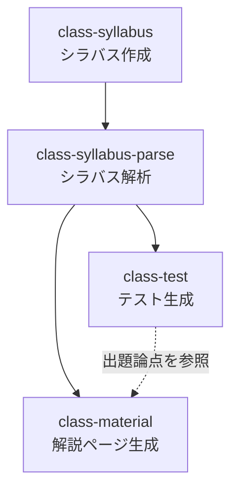

# NITYC-MCC-Tools

弓削商船高等専門学校（NITYC）の教育業務を支援するClaude Codeスキル集。高専モデルコアカリキュラム（MCC）に基づく情報系分野（V-D）の参照資料とスキルを提供する。

## 概要

- MCCに基づいたシラバス作成を支援
- 情報系分野（プログラミング、ソフトウェア、計算機工学、ネットワーク等）に対応
- テスト問題の自動生成とMoodle XMLでの出力を支援

## 含まれるファイル

| ファイル/フォルダ | 説明 |
|------------------|------|
| `docs/Kosen-MCC2023-Tech.pdf` | MCC2023原本 |
| `.claude/skills/class-syllabus/` | シラバス作成スキル |
| `.claude/skills/class-syllabus-parse/` | シラバス解析スキル（後続スキルの共通前処理） |
| `.claude/skills/class-test/` | テスト問題生成スキル |
| `.claude/skills/class-material/` | 授業解説ページ（HTML）生成スキル |
| `specs/` | スキル間の共有契約（出力レイアウト・スキーマ・対話規約） |
| `.github/workflows/pages.yml` | 授業資料の GitHub Pages 公開ワークフロー |
| `CLAUDE.md` | Claude Code用の指示ファイル |

## 授業資料の公開

`output/*/materials/` 配下の資料は、`main` への push で GitHub Pages に自動公開される。公開されるのは materials 配下のみで、シラバス本体・`docs/`・`tests/` はサイトに含まれない。

```
https://[owner].github.io/[repo]/[YYYY]_[教科名]/class[週番号]_[テーマ].html
```

初回のみ、リポジトリの Settings → Pages で Source を "GitHub Actions" に設定する必要がある。公開範囲の注意点は [CONTRIBUTING.md](CONTRIBUTING.md) § 4 を参照。

## セットアップ

`./bootstrap.sh` を実行すると依存チェックと Python パッケージ導入を行う。`--help` で使い方表示。

各教員が fork して自分の授業ワークスペースとして使う運用を想定している。fork 手順・upstream の同期（`./sync.sh`）・改善の還元方法は [CONTRIBUTING.md](CONTRIBUTING.md) を参照。

手動で入れるもの:

- [Python 3](https://www.python.org/) — ランタイム
  - [openpyxl](https://openpyxl.readthedocs.io/) — シラバス Excel 操作（bootstrap.sh が pip install --user）

## スキルの実行順序・ユースケース

正規フローは `syllabus → syllabus-parse → test / material`。

**どこから始めるか**:

- **新規科目を立ち上げる**: `class-syllabus` から入る（シラバス作成 → 以降の運用フローへ）
- **既存シラバスを流用する**: `class-test` / `class-material` から直接入る
  - 初回実行時に `class-syllabus-parse`（シラバス解析の共通前処理）が自動案内される
- **授業の解説資料を作る**: `class-material` から入る（当該回より前の小テストが作成済みであることが望ましい）


```mermaid
flowchart TD
    S[class-syllabus<br/>シラバス作成] --> P[class-syllabus-parse<br/>シラバス解析]
    P --> T[class-test<br/>テスト生成]
    P --> M[class-material<br/>解説ページ生成]
    T -.出題論点を参照.-> M
```

補足:

- `class-syllabus-parse` はセッション冒頭で明示実行しておく。重い生成スキルはセッションを分けて都度 parse からやり直す。

## 出典

- [高専機構 モデルコアカリキュラム（令和5年度版）](https://kosen-k.go.jp/wp/wp-content/uploads/2023/12/2c383e29-7e20-4b20-af19-ca3737450665.pdf)

## ライセンス

本リポジトリは [MIT License](LICENSE) で提供する。

ただし以下は MIT の対象外で、著作権は各権利者に帰属する。詳細は [LICENSE](LICENSE) の「Third-party materials」節を参照すること。

- `docs/Kosen-MCC2023-Tech.pdf` — 高専機構のモデルコアカリキュラム原本（オフライン参照用に同梱）
- `output/*/materials/assets/kousho.svg` — 弓削商船高等専門学校の校章

fork して再配布する場合は、これらの扱いを事前に確認すること。
