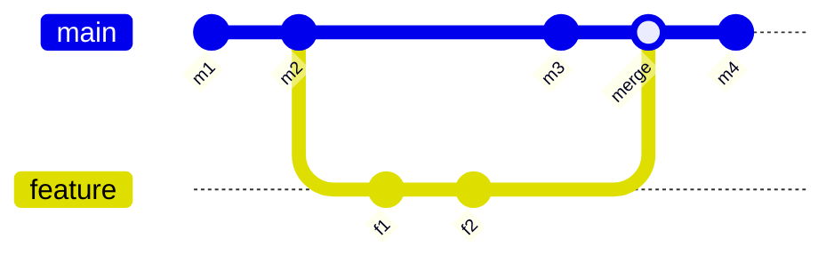

<!--
class: flex-layout natural-height
-->

# ソフトウェア工学特論 講義資料

## 第5回 gitの実践：ブランチ・マージ・リベース

- ブランチの作成・切替
- マージとリベースの違い
- コンフリクトの解消方法

---

# 目次

- ブランチの基礎
- マージとリベース
- コンフリクトへの対処

---

# ブランチの基礎

---

<!--
class: flex-layout
-->

# 今回の目的と到達目標

<div class="columns">
<div>

## 今回の目的

- 並行開発のためのブランチを扱えるようになる
- マージとリベースの使い分けを理解する
- コンフリクトに落ち着いて対応できる

</div>
<div>

## 到達目標

- [R2-未到達] branch/merge の基本操作
- [R2-標準] ブランチ戦略に基づく運用の基礎

</div>
</div>

---

<!--
class: flex-layout natural-height
-->

# ブランチとは

- **履歴の枝分かれ** を作って並行作業する仕組み
- `main`（旧 master）が既定のブランチ
- 機能・修正ごとに別ブランチを切る
- 完成したら `main` に統合する（マージ）
- チーム開発の前提：main は常に動く状態に保つ

---

<!--
class: flex-layout natural-height
-->

# ブランチの基本コマンド

| コマンド | 役割 |
|---------|------|
| `git branch` | ブランチ一覧 |
| `git branch <name>` | ブランチ作成 |
| `git switch <name>` | ブランチ切替（旧 `checkout`） |
| `git switch -c <name>` | 作成して即切替 |
| `git branch -d <name>` | ブランチ削除 |

命名例：`feature/login`, `fix/typo`, `refactor/api`

---

# マージとリベース

---

<!--
class: flex-layout natural-height
-->

# マージとリベースの違い

| 操作 | 履歴の形 | 使いどころ |
|------|---------|----------|
| merge | マージコミットを残して合流 | 共有ブランチへの取り込み |
| rebase | 履歴を一直線に整形 | 自分のブランチのみ |

**原則**：公開済みコミットはリベースしない（履歴が書き換わるため）。

---

<!--
class: flex-layout natural-height
-->

# ブランチ・マージ・リベースの履歴遷移

- 3つの履歴形状を1枚で比較
- 左：並行開発中 / 中央：mergeで合流（分岐を残す）/ 右：rebaseで一直線化

下記のmermaidコードを Mermaid Viewer（<https://mermaid.live>）に貼り付けると図として確認できます。



---

<!--
class: flex-layout natural-height
-->

# 実行コマンド

```bash
# マージ：feature を main に取り込む
git switch main
git merge feature

# リベース：feature を main の先端に付け替える
git switch feature
git rebase main
```

- merge は `main` の先で合流（マージコミット1個生成）
- rebase は `feature` の各コミットを main 先端に再適用

---

# コンフリクトへの対処

---

<!--
class: flex-layout natural-height
-->

# コンフリクトとは

- 同じファイルの同じ箇所を **両方のブランチで変更** したとき発生
- gitは自動統合できず、人間の判断を求める
- マージ時もリベース時も発生しうる
- 冷静に見れば「どちらの変更を採用するか」を決めるだけ

---

<!--
class: flex-layout natural-height
-->

# コンフリクト表示の読み方

```
<<<<<<< HEAD
main側の内容
=======
feature側の内容
>>>>>>> feature
```

1. マーカーを手で削除し、正しい内容に編集する
2. `git add <file>` で解消を通知
3. merge中なら `git commit`、rebase中なら `git rebase --continue`

迷ったら `git status` が次の指示を教えてくれる。

---

# 今回のまとめ

- ブランチは並行開発のための履歴の枝分かれ
- マージは履歴を残す合流、リベースは一直線化
- 公開済みコミットはリベースしない
- コンフリクトは **どちらを採用するか** の判断

### 今回カバーしたMCC項目

- V-D-1 プログラミング
- V-D-4 コンピュータシステム

### 次回予告

- 第6回: GitHubとリモートリポジトリ
