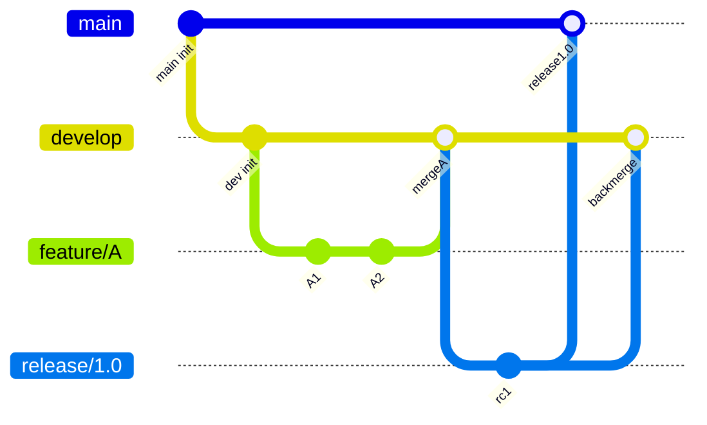

<!--
class: flex-layout natural-height
-->

# ソフトウェア工学特論 講義資料

## 第7回 GitHub Issue・Pull Request・ブランチ戦略

- Issue駆動のタスク管理
- Pull Requestとコードレビューの流れ
- ブランチ戦略（GitHub Flow / Git Flow）

---

# 目次

- Issueによるタスク管理
- Pull Requestとコードレビュー
- ブランチ戦略の選択

---

# Issueによるタスク管理

**関連ドキュメント**: [この節の解説](https://github.com/atsuki-seo/NITYC-MCC-Tools/issues/55)

---

<!--
class: flex-layout
-->

# 今回の目的と到達目標

<div class="columns">
<div>

## 今回の目的

- IssueとPRの役割を理解する
- コードレビューの流れを体験する
- チームに合うブランチ戦略を検討する

</div>
<div>

## 到達目標

- [R2-標準] Issue・PRを活用したチーム開発の主導
- [R2-理想] ブランチ戦略の設計・提案

</div>
</div>

---

<!--
class: flex-layout natural-height
-->

# Issueとは

- **やるべきこと／課題** を1単位ずつ記録する場所
- タイトル・本文・ラベル・担当者・マイルストーン
- 機能追加・バグ・調査・ドキュメント など何でも
- 粒度：**1 Issue = 1 PR** でマージできる大きさが理想
- チーム開発では **10件以上** の Issue 作成が必須

---

<!--
class: flex-layout natural-height
-->

# Issueの書き方

```markdown
## 概要
ログイン画面のバリデーションエラーが表示されない

## 再現手順
1. 空欄のままログインボタンを押す
2. エラーメッセージが出ない（期待：「必須」）

## 完了条件
- 空欄時にメッセージを表示
- テストケースを追加
```

- **概要 / 背景 / 完了条件** の3点を最低限書く
- 完了条件があるとレビューでの判定が楽になる

---

# Pull Requestとコードレビュー

**関連ドキュメント**: [この節の解説](https://github.com/atsuki-seo/NITYC-MCC-Tools/issues/56)

---

<!--
class: flex-layout natural-height
-->

# Pull Request（PR）とは

- ブランチの変更を **main に取り込む提案**
- コードレビューとディスカッションの場
- マージ前のテスト・CIチェックを通す関門
- Issueと紐付けて「どのIssueに対応するPRか」を示す
- 本講座では **全メンバーが最低1本マージ** が必須

---

<!--
class: flex-layout natural-height
-->

# PRの運用フロー

1. Issueを作成（または既存Issueを選ぶ）
2. `feature/xxx` ブランチを切って実装
3. push して GitHub 上で PR 作成（本文に `Closes #12` 等でIssueを紐付け）
4. レビュアーが差分を確認・コメント
5. 指摘を反映 → 再レビュー
6. 承認後にマージ、ブランチ削除

レビューは **形式的ではなく指摘の根拠を添える** こと。

---

<!--
class: flex-layout natural-height
-->

# レビュー時の観点

| 観点 | 見るところ |
|------|----------|
| 動作 | 要件を満たすか、テストが通るか |
| 可読性 | 命名・構造・コメント |
| 設計 | 責務分離・重複の有無 |
| 安全性 | 想定外入力への対応 |
| Issue対応 | 完了条件を満たすか |

「LGTM」だけでなく **何を見たか** を残す。

---

# ブランチ戦略の選択

**関連ドキュメント**: [この節の解説](https://github.com/atsuki-seo/NITYC-MCC-Tools/issues/57)

---

<!--
class: flex-layout natural-height
-->

# 代表的な2戦略

| 戦略 | 特徴 | 適する規模 |
|------|------|----------|
| GitHub Flow | main + feature。常にデプロイ可能 | 小〜中、継続デプロイ |
| Git Flow | develop/release/hotfixなど多層 | 中〜大、リリース版管理 |

- 本講座のチーム開発は **GitHub Flow を推奨** （シンプル・学習コスト低）
- 必要に応じて Git Flow の一部を取り入れてよい

---

<!--
class: flex-layout natural-height
-->

# GitHub Flow と Git Flow の分岐合流

- GitHub Flow：main から feature を切り、PR で main に戻す（常にデプロイ可能）
- Git Flow：main / develop を分け、release / hotfix ブランチで段階的に統合する

下記のmermaidコードを Mermaid Viewer（<https://mermaid.live>）に貼り付けると図として確認できます。



---

# 今回のまとめ

- Issueで課題を1単位ずつ管理（10件以上必須）
- PRはレビューとマージの関門、全員が1本以上マージ
- GitHub Flow を基本、チームで合意して運用
- 「LGTM」だけでなく **根拠付きレビュー** を

### 今回カバーしたMCC項目

- V-D-1 プログラミング
- V-D-4 コンピュータシステム

### 次回予告

- 第8回: チーム開発準備 — テーマ設定・チーム分け
