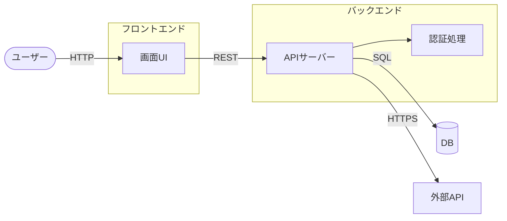

<!--
class: flex-layout natural-height
-->

# ソフトウェア工学特論 講義資料

## 第10回 チーム開発②：基本設計

- 画面設計（外部仕様）
- DB設計（ER / テーブル）
- システム構成図

---

# 目次

- 画面設計
- DB設計
- システム構成図

---

# 画面設計

**関連ドキュメント**: [この節の解説](https://github.com/atsuki-seo/NITYC-MCC-Tools/issues/64)

---

<!--
class: flex-layout
-->

# 今回の目的と到達目標

<div class="columns">
<div>

## 今回の目的

- 要件を外部仕様に落とす
- DB構造を設計する
- システム全体の構成を図示する

</div>
<div>

## 到達目標

- [R3-標準] 基本設計工程の管理
- [R2-標準] 設計Issueの追加とPR連携

</div>
</div>

---

<!--
class: flex-layout natural-height
-->

# 画面設計のポイント

- **要件ID → 画面** の対応表を作る
- 1画面 = 1 Issue で設計PRを出す運用が管理しやすい
- 画面項目（入力 / 表示 / ボタン）と **遷移先** を明記
- 入力バリデーションは画面設計段階で決めておく
- Figma / 手書きスキャン / Markdown表 いずれでも可

---

<!--
class: flex-layout natural-height
-->

# 画面項目表の例

| 項目 | 型 | 必須 | 備考 |
|------|----|-----|------|
| メールアドレス | text | ○ | RFC準拠 |
| パスワード | password | ○ | 8〜32字 |
| ログインボタン | button | — | 押下時バリデーション |

画面遷移は **遷移元→イベント→遷移先** で整理。

---

# DB設計

**関連ドキュメント**: [この節の解説](https://github.com/atsuki-seo/NITYC-MCC-Tools/issues/65)

---

<!--
class: flex-layout natural-height
-->

# テーブル設計の基本

- **エンティティ** を洗い出す（ユーザー・予約・商品など）
- 各テーブルに **主キー** を置く
- 関係（1対多・多対多）を明確にする
- 正規化：**1テーブルに1つの事象** が原則
- 多対多は中間テーブルを挟む

---

<!--
class: flex-layout natural-height
-->

# テーブル定義の例

```markdown
## users
| カラム | 型 | 制約 |
|--------|----|------|
| id | INT | PK, AUTO_INCREMENT |
| email | VARCHAR(255) | UNIQUE, NOT NULL |
| password_hash | VARCHAR(255) | NOT NULL |
| created_at | DATETIME | NOT NULL |
```

- 型・制約・デフォルト値を明記
- 外部キーは別途「関係」セクションで記述

---

# システム構成図

**関連ドキュメント**: [この節の解説](https://github.com/atsuki-seo/NITYC-MCC-Tools/issues/66)

---

<!--
class: flex-layout natural-height
-->

# 基本設計：システム構成・データフロー

- クライアント → サーバ → DB の3層構成例
- 外部APIを使う場合はその箇所も明示
- コンポーネント境界と通信プロトコルを1枚で表す

下記のmermaidコードを Mermaid Viewer（<https://mermaid.live>）に貼り付けると図として確認できます。



---

<!--
class: flex-layout natural-height
-->

# 基本設計が仕様書に入る理由

- 第14週の仕様書PDFに **基本設計** セクションが必須
- 第三者（教員・他チーム）が **開発を追体験** できる水準
- 図表なしの文章だけでは標準的到達に届かない
- 今週から **図・表を仕様書に貼れる形** で作っておく

---

# 今回のまとめ

- 画面・DB・システム構成を同時並行で設計
- 要件IDと各設計要素を紐付ける対応表を作る
- DBは正規化、外部キー関係を明記
- 構成図は仕様書に貼れる形で作成

### 今回カバーしたMCC項目

- V-D-4 コンピュータシステム

### 次回予告

- 第11回: チーム開発③ 詳細設計（処理フロー・モジュール設計）
