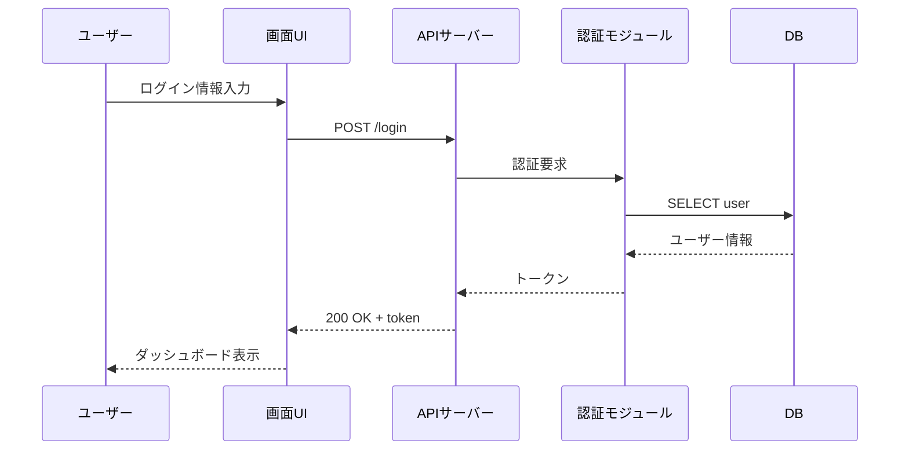

<!--
class: flex-layout natural-height
-->

# ソフトウェア工学特論 講義資料

## 第11回 チーム開発③：詳細設計

- 処理フローの設計
- モジュール分割と責務設計
- Issue・PRを活用した本格開発の開始

---

# 目次

- 処理フロー設計
- モジュール設計
- 詳細設計と実装の接続

---

# 処理フロー設計

**関連ドキュメント**: [この節の解説](https://github.com/atsuki-seo/NITYC-MCC-Tools/issues/67)

---

<!--
class: flex-layout
-->

# 今回の目的と到達目標

## 今回の目的

- 主要機能の処理フローを設計する
- モジュールに分割し責務を定める
- 実装Issueを生成する

## 到達目標

- [R3-標準] 詳細設計工程の管理
- [R2-標準] Issue/PR運用の本格始動

---

<!--
class: flex-layout natural-height
-->

# 処理フローの粒度

- 基本設計＝「何を」、詳細設計＝「どう」
- 主要機能（F-xx）ごとに1枚ずつフローを書く
- 入力 → 処理の各ステップ → 出力の **順** で記述
- エラー時の分岐も明記する
- 実装者が **そのまま関数に落とせる** 粒度が理想

---

<!--
class: flex-layout natural-height
-->

# モジュール間シーケンス

- 主要機能の「UI → API → 認証 → DB」の呼び出し順序
- アクター間のメッセージを時系列で追える形で表す
- エラー時の分岐も1枚で把握する

下記のmermaidコードを Mermaid Viewer（<https://mermaid.live>）に貼り付けると図として確認できます。

---

# モジュール設計

**関連ドキュメント**: [この節の解説](https://github.com/atsuki-seo/NITYC-MCC-Tools/issues/68)

---

<!--
class: flex-layout natural-height
-->

# 責務の原則

- 1モジュール = 1責務（単一責任原則）
- 他モジュールへの依存は **明示的に** 書く
- 責務が曖昧な「Utility」「Common」を作らない
- **誰が何を呼ぶか** を設計時点で決める
- ファイル構成・ディレクトリ構成もここで設計

---

<!--
class: flex-layout natural-height
-->

# モジュール一覧表

| モジュール | 責務 | 主な関数 |
|----------|------|---------|
| auth | 認証・認可 | login / verify_token |
| user_api | ユーザーAPI | get_user / update_user |
| reservation_api | 予約API | create / list / cancel |
| db | DB接続・クエリ実行 | query / transaction |

**責務がない関数は別モジュール** に動かす判断をする。

---

# 詳細設計と実装の接続

**関連ドキュメント**: [この節の解説](https://github.com/atsuki-seo/NITYC-MCC-Tools/issues/69)

---

<!--
class: flex-layout natural-height
-->

# 設計Issueを実装Issueに分割

- 基本設計Issue → 複数の実装Issueに分割
- 例：「F-02 ログイン」Issue → 画面実装 / API実装 / 認証処理 / テスト
- 1 Issue = 1 PR でマージできる粒度に
- **PRを出す前** にIssueを作る（逆にしない）

今週以降、Issue総数は加速的に増える。**ラベル運用** を徹底。

---

<!--
class: flex-layout natural-height
-->

# Issueラベル運用例

| ラベル | 用途 |
|-------|------|
| `feature` | 機能実装 |
| `design` | 設計ドキュメント |
| `bug` | 不具合修正 |
| `test` | テスト追加 |
| `chore` | 設定・雑務 |
| `priority:high` | 優先度 |

ラベルで **フィルタリングして進捗確認** する。

---

# 今回のまとめ

- 詳細設計は実装者が関数に落とせる粒度で
- モジュール分割は単一責任原則、曖昧なUtilityを作らない
- 設計Issueを実装Issueに分解、ラベルで管理
- 今週から **Issue駆動の本格開発** に入る

### 今回カバーしたMCC項目

- V-D-4 コンピュータシステム

### 次回予告

- 第12回: チーム開発④ 実装（PRコードレビュー・AI活用記録）
