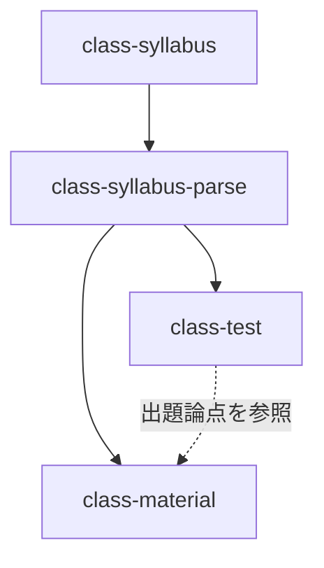

# class-material スキル仕様（設計案）

授業テーマを入力として、iPad投影とスマートフォン閲覧の双方に耐える解説ページ（単一HTML）を生成するスキルの仕様。

参考実装: `output/2026_アルゴリズム/materials/class01-02_基本データ型・変数・配列.html`

---

## 1. スキル概要

| 項目 | 内容 |
|------|------|
| スキル名 | `class-material` |
| 入力 | 授業テーマ（ユーザーのプレーンテキスト入力）＋ シラバス情報（`class-syllabus-parse` のコンテキスト） |
| 出力 | `output/[YYYY]_[教科名]/materials/[回次]_[テーマ].html` |
| 位置づけ | 正規フロー `syllabus → syllabus-parse → material` の末端。`class-test` と並列の生成スキル |

### 1.1 なぜ必要か

小テスト・定期試験の生成（`class-test`）は整備済みだが、**授業そのものを進行するための資料**が手作業のままである。本スキルは、シラバスの授業計画・到達目標を入力として、投影用スライドと学生の手元資料を兼ねる解説ページを生成し、板書・スライド作成の負荷を削減する。

### 1.2 設計上の中核的判断

**要点設計をスキルの主業務とする。** ユーザーからの入力は「授業のテーマ」のみであり、何を話すべきかの構成設計はスキル側の責任である。テーマを受け取った直後にHTMLを書き始めてはならず、**Step 2 の要点設計とユーザー合意を必ず経由する**。

---

## 2. ファイル構成と共通CSS

### 2.1 出力レイアウト

`specs/output-layout.md` に以下を追補する。

```
output/
└── [YYYY]_[教科名]/
    ├── [シラバスファイル名].md
    ├── tests/
    └── materials/                              ← class-material 出力
        ├── assets/
        │   ├── material.css                    ← 共通CSS（全回で共有）
        │   └── kousho.svg                      ← 校章（既存）
        ├── class01-02_基本データ型・変数・配列.html
        └── class03_スタック・キュー.html
```

### 2.2 共通CSSの扱い

- 共通CSS `materials/assets/material.css` を**正本**とし、各回のHTMLは `<link rel="stylesheet" href="assets/material.css">` で参照する
- 共通CSSが未生成の科目フォルダでは、初回実行時にスキルが生成する（2回目以降は既存を再利用し、上書きしない）
- 各HTMLに書いてよいのは、**その回固有の図版スタイル**に限る。汎用的に使えると判断したものは共通CSSへ昇格させる

**参考実装の移行**: 既存の `class01-02_基本データ型・変数・配列.html` は `<style>` 埋め込み型である。本スキルの初回導入時に、このファイルのCSSを `material.css` へ切り出し、当該HTMLを `<link>` 参照へ書き換える移行作業を含める（スキル本体の処理フローではなく、導入時の一度きりの作業として扱う）。

### 2.3 共通CSSに含める要素

参考実装のCSSをそのまま正本化する。構成は以下。

| ブロック | 主なクラス | 役割 |
|----------|-----------|------|
| 変数定義 | `:root` / `[data-theme]` / `prefers-color-scheme` | 配色・基準フォントサイズ。ライト/ダーク両対応 |
| 基本体裁 | `html` `body` `.wrap` | 日本語フォントスタック、行送り 1.8、`palt` |
| ヘッダ | `header.doc-head` `.crest` `.eyebrow` `h1` `.doc-meta` | 校章つき見出し |
| 目次 | `nav.toc` (`details`) | 折りたたみ目次 |
| 本文 | `section` `h2 .num` `h3` `p` `ul/ol` `strong` `.term` `.en` | 節番号・用語強調・英語併記 |
| コード | `code` `pre` | 擬似コード表示 |
| 表 | `.table-scroll` `table` `th` `td.num-cell` | 横スクロール対応 |
| 注記 | `.note` `.note.caution` `.label` | 補足・注意喚起 |
| 図版 | `figure` `figcaption` `.svg-*` | インラインSVG用クラス群 |
| 確認問題 | `.quiz` `.quiz-label` `.choices` `details.answer` `.answer-body` `.verdict` | アコーディオン解答 |
| フッタ | `footer.doc-foot` | 学校名・担当者 |
| 画面幅 | `@media` (600px / 1200px / print) | 端末別調整 |

---

## 3. 表示要件

### 3.1 フォントサイズ

要件「20pt以上」は `--fs-base` で一元管理する。

| 条件 | `--fs-base` |
|------|-------------|
| 既定 | `20pt` |
| `max-width: 600px`（スマートフォン） | `20pt`（縮小しない） |
| `min-width: 1200px`（iPad投影・大画面） | `22pt` |

配下の要素は `rem` 相対指定とし、**絶対 `pt` 指定を追加しない**。これにより 20pt 下限が構造的に保証される。

### 3.2 想定利用シーン

| シーン | 対応する設計 |
|--------|-------------|
| iPad投影（教員が順に参照） | 目次からの節ジャンプ、`section` 単位の区切り、節番号 `.num` |
| 学生のスマートフォン | 単一カラム、`max-width: 46rem`、表の横スクロール、20pt維持 |
| 学生のPC | 1200px以上で 22pt / 50rem に拡張 |
| 授業中・授業後の自習 | 確認問題のアコーディオン解答 |
| 印刷・PDF配布 | `@media print` で目次非表示、解答は開いた状態の体裁 |

### 3.3 確認問題の挙動

- 各節の末尾に `.quiz` を配置する。問題は節の内容から直接答えられるものとする
- 解答は問題の**すぐ下**に置き、`details.answer` で既定は閉じた状態にする
- `summary` のラベルはCSSの `::before` で制御する（開: `− 解答を閉じる` / 閉: `＋ 解答を確認する`）
- 解答本文は `.verdict`（正解の明示）＋ 解説（各選択肢がなぜ誤りかまで述べる）で構成する
- JavaScript は使用しない。`details`/`summary` のネイティブ挙動のみで完結させる

---

## 4. 内容設計の方針

### 4.1 口調・表現

アカデミックな文体で統一する。

- 常体（「〜である」「〜する」）で記述し、敬体（「〜です」「〜ます」）を用いない
- 「〜しましょう」「〜してみよう」等の呼びかけを用いない
- 用語の初出時は `<span class="term">用語</span><span class="en">(English)</span>` の形式で原語を併記する
- 断定できない事柄は「一般に」「多くの場合」等で限定し、過度の単純化を避ける

### 4.2 予告の禁止

以下は**出力に含めない**。

- 「次回は〜を扱う」「以降の授業で説明する」等の予告
- 「前回学んだとおり」等、特定の授業回への依存を前提とする記述

理由: 資料の汎用性・再利用性を損なうためである。他の回や他年度でも単体で成立する記述とする。

なお、当該回の到達点を述べる `.note`（参考実装の「本講の到達点」）は予告ではなく、含めてよい。

### 4.3 コード表現

特定言語の構文に依存しない。

- **概念図**（インラインSVG）と**擬似コード**を中心に据える
- 擬似コードは代入に `←` を用い、制御構造は日本語で記述する
- 特定言語の実行可能コードを掲載しない

擬似コードの例:

```
1. a ← 3
2. b ← 8
3. a ← b
```

### 4.4 図版

- インラインSVG で記述し、外部画像ファイルに依存しない
- 配色は `.svg-cell` `.svg-hl` `.svg-arrow` 等の共通クラスを用い、SVG内に色値を直書きしない（ダークモード対応のため）
- `role="img"` と `aria-label` で内容を説明する
- `figcaption` は「図 [節番号]-[連番]　説明文」の形式とする

---

## 5. 直近の小テストとの連携

### 5.1 目的

直近の小テストで問うた論点を、解説ページの本文・確認問題に**自然に織り込む**。復習機会を与え、理解の定着を図る。

### 5.2 「直近」の判定

シラバスの授業計画には小テストの実施週と範囲が記載される（例: `5週 | ... 小テスト①（範囲: 第1〜4週）`）。

判定手順:

1. 生成対象の授業回の週番号を、シラバスの授業計画から特定する
2. Step 1.5 で作成済みと確認された小テストのうち、実施週が**対象回の週番号以前**であるものを対象とする
3. そのうち最も週番号が大きいものを「直近の小テスト」とする
4. 該当なし（対象回より前に小テストが実施されていない、または当該科目に小テストの定義がない）の場合、本連携はスキップする

なお、直近の1件を主たる織り込み対象としつつ、それ以前の小テストで繰り返し問われている論点があれば、定着が不十分な箇所として併せて扱ってよい。

### 5.3 参照するファイル

`[テスト名]_確認用.md` と `[テスト名]_解説.md` を読み取り、出題論点を抽出する。ファイルパスの契約は `specs/output-layout.md` に従う。

### 5.4 織り込み方

- 小テストの**設問文をそのまま転載しない**。問うた論点を本文の説明に組み込むか、確認問題として再構成する
- 「小テストで出題した」等の言及はしない。§4.2 の予告禁止と同様、特定回への依存を避けるためである
- 織り込んだ論点は Step 5 の完了レポートでユーザーに報告する

---

## 6. 処理フロー

```
Step 0: シラバス情報の読み込み
Step 1: テーマの受け取りと授業回の特定
Step 1.5: 前提資材の検証 → 不足時の判断     ★生成前のゲート
Step 2: 要点の設計 → プレビュー → ユーザー合意   ★スキルの中核
Step 3: 直近の小テストの参照
Step 4: HTML生成（共通CSSの生成・再利用を含む）
Step 5: ファイル出力 → 完了レポート
```

### Step 0: シラバス情報の読み込み

`class-syllabus-parse` に委譲する。`class-test` と同一の扱いとし、未読み込みの場合は事前実行を案内する。

```
解説ページの作成にはシラバス情報の解析が必要です。
先に `/class-syllabus-parse` スキルを実行してシラバスを読み込んでください。
```

本スキルが利用する情報: 基本情報（教科名・開講年度・担当教員・対象学年・開講期・開設学科）、授業計画（週・授業内容・到達目標）、到達目標。

### Step 1: テーマの受け取りと授業回の特定

プレーンテキストでテーマを受け取る。

```
解説ページを作成する授業のテーマを教えてください
（例: スタック・キュー）:
```

受け取ったテーマをシラバスの授業計画と照合し、該当する週を特定する。

- **単一の週に対応する場合**: その週を採用する
- **複数の週にまたがる場合**（参考実装は1〜2週）: `AskUserQuestion` で範囲を確認する
- **照合できない場合**: `AskUserQuestion` で候補の週を提示し、選択させる（"Other" で範囲外のテーマも受け付ける）

ここで確定した週番号は、ファイル名の回次（`class01-02` / `class03`）と §5.2 の直近小テスト判定に用いる。

### Step 1.5: 前提資材の検証（生成前ゲート）

要点設計に入る前に、**入力として依拠する資材が揃っているか**を検証する。不足に気づかないまま生成すると、シラバスとの不整合や §5 の小テスト連携の欠落が、出力後まで発覚しない。

#### 1.5.1 シラバス側の検証

Step 0 で読み込んだシラバス情報について、本スキルが必要とする項目の充足を確認する。

| 検証項目 | 判定 | 不足時の扱い |
|----------|------|-------------|
| 基本情報（教科名・開講年度・担当教員・対象学年・開講期・開設学科） | ヘッダ/フッタの記載に必要 | 不足項目をユーザーに確認して補完する |
| 授業計画に対象回の行が存在する | 週番号の確定に必要 | Step 1 に差し戻す |
| 対象回の到達目標が記載されている | 要点設計の起点 | 警告し、テーマから設計してよいか確認する |
| 到達目標が `（要確認）` を含まない | 内容の信頼性 | 該当箇所をユーザーに提示して確定させる |

#### 1.5.2 小テストの検証（シラバスに小テストが定義されている場合のみ）

まずシラバスの評価割合・試験スケジュール・授業計画から、**当該科目に小テストが定義されているか**を判定する。定義されていない科目では本検証を行わず、§5 の連携ごとスキップする（判定は `specs/syllabus-markdown-schema.md` §2.3 の評価割合カテゴリキー `小テスト` と、§3.2 試験スケジュールによる）。

小テストが定義されている場合、**対象回より前に実施される全ての小テスト**について、成果物が作成済みかを検証する。

検証手順:

1. シラバスから、実施週が対象回の週番号以前である小テストを全件列挙する
2. 各小テストについて `output/[YYYY]_[教科名]/tests/[テスト名]/` の存在を確認する
3. 存在する場合、`[テスト名]_確認用.md` と `[テスト名]_解説.md` が揃っているかを確認する

「直近の1件」ではなく**先行する全件**を対象とする。解説ページはその回までの学習内容の上に成り立つため、途中の回の小テストが欠けていれば、織り込むべき論点の把握が不完全になるためである。

#### 1.5.3 不足時の扱い

検証結果を提示し、`AskUserQuestion` で判断を仰ぐ。

```
=== 前提資材の検証結果 ===
対象: 第[N]週「[テーマ]」

シラバス: [OK | 以下が不足]
  - [不足項目]

先行する小テスト（第[N]週以前）:
  ✓ 小テスト1（第5週）  作成済み
  ✗ 小テスト2（第8週）  未作成
  △ 小テスト3（第10週） 解説ファイルが不足
```

選択肢:

1. **不足分の小テストを作成する**: `/class-test` の実行を案内し、本スキルを一旦終了する。作成後に再度本スキルを実行してもらう
2. **このまま続行する**: 作成済みの小テストのみを §5 の連携対象とする。未作成分は織り込まれない旨を明示して進む
3. **中断する**

検証が全て `OK` の場合は、この確認を挟まず Step 2 へ進む。

### Step 2: 要点の設計（中核）

テーマと到達目標から、**話すべき要点を設計する**。ここがスキルの主業務である。

設計の観点:

1. **導入**: そのテーマがなぜ必要か。扱わない場合に何が困るかを、具体的な状況で示す
2. **中核概念の展開**: 概念を定義 → 仕組みの説明 → 図解 の順で積み上げる。1節1概念を原則とする
3. **性質の対比**: 得意・不得意、他の手法との比較など、判断の根拠となる観点を示す
4. **到達点**: シラバスの当該週の到達目標と対応づける
5. **総括**: 節ごとの要点を再掲し、全体を締める

節の分割は、上記の観点を満たすのに要する数だけ置く。1節1概念の原則を保てなくなったら分割し、独立した概念として述べることがなくなったら統合する。各節に確認問題を1問以上配置する。

設計結果を以下の形式でプレビューし、`AskUserQuestion` で合意を取る。

```
=== 解説ページ構成案: [テーマ] ===
対象: 第[N]週 ／ 到達目標: [シラバスの到達目標]

1. [節タイトル]
   要点: [その節で述べること]
   図版: [有無と内容]
   確認問題: [問う論点]

2. ...

直近の小テスト: [テスト名]（第[M]週実施）
  織り込む論点: [論点1] / [論点2]
```

`AskUserQuestion` の選択肢: 「確定する」「節構成を修正したい」「確認問題を修正したい」「中断する」。修正ループの作法は `specs/dialog-conventions.md` に従う。

**合意が取れるまで HTML を生成しない。**

### Step 3: 直近の小テストの参照

§5 に従って直近の小テストを特定し、出題論点を抽出する。対象は Step 1.5 で作成済みと確認されたものに限る。結果は Step 2 のプレビューに含めて提示済みであるため、ここでは抽出内容を確定させる。

### Step 4: HTML生成

`references/html-template.md` のテンプレートに従って生成する。

1. `materials/assets/material.css` の存在を確認し、無ければ生成する（既存の場合は上書きしない）
2. `materials/assets/kousho.svg` の存在を確認し、無ければ既存科目からコピーするか生成する
3. 単一HTMLを生成する

生成時の必須チェック:

- [ ] 予告・次回言及を含んでいないか（§4.2）
- [ ] 特定言語の構文に依存していないか（§4.3）
- [ ] 敬体が混入していないか（§4.1）
- [ ] 全ての `.quiz` に `details.answer` が対応しているか
- [ ] SVG内に色値の直書きが無いか（§4.4）
- [ ] 目次の `href` と `section` の `id` が対応しているか

### Step 5: ファイル出力と完了レポート

ファイル単位の既存検出を行う（`specs/file-output-policy.md` §1.2）。既存時は「上書きする / 別名で保存する / キャンセル」を提示する。

完了レポート:

```
=== 解説ページを作成しました ===
出力先: output/[YYYY]_[教科名]/materials/[ファイル名].html
共通CSS: materials/assets/material.css（[新規作成 | 既存を再利用]）

構成: [N]節 ／ 確認問題 [M]問 ／ 図版 [K]点
織り込んだ直近小テストの論点: [論点]

ブラウザで開いて確認してください。
```

---

## 7. ファイル命名規約

`specs/output-layout.md` に追補する。

- 形式: `class[週番号]_[テーマ].html`
- 複数週にまたがる場合: `class[開始]-[終了]_[テーマ].html`
- 週番号はゼロ埋め2桁（`class01`, `class03`, `class01-02`）
- テーマ名はシラバスの授業内容またはユーザー入力をそのまま用いる（`specs/syllabus-markdown-schema.md` §5.3 の共通ルールに従って正規化）

---

## 8. スキルのファイル構成

```
.claude/skills/class-material/
├── SKILL.md                            ← 処理フロー本体
└── references/
    ├── html-template.md                ← HTML骨格・各コンポーネントのマークアップ
    ├── material.css                    ← 共通CSSの正本（科目フォルダへコピー）
    ├── content-design-guide.md         ← 要点設計の方法論（Step 2 の詳細）
    ├── writing-style-guide.md          ← 文体・用語・禁止表現
    ├── figure-guide.md                 ← SVG図版の作図パターン
    └── quiz-guide.md                   ← 確認問題の設計
```

### 8.1 各リファレンスの責務

| ファイル | 内容 |
|----------|------|
| `html-template.md` | `<head>`〜フッタまでの骨格。ヘッダ・目次・節・注記・表・図版・確認問題の各マークアップ例。参考実装から抽出する |
| `material.css` | §2.3 の共通CSS。参考実装のCSSを正本化したもの |
| `content-design-guide.md` | 要点設計の観点（§6 Step 2 の1〜5）、節の分割・統合の判断、導入の書き出しパターン、到達目標との対応づけ |
| `writing-style-guide.md` | 常体の徹底、用語の英語併記、予告の禁止、擬似コードの記法 |
| `figure-guide.md` | 頻出図版の型（配列のセル列、変数の上書き、構造の遷移、比較表）と `.svg-*` クラスの使い分け |
| `quiz-guide.md` | 選択肢の作り方（誤答選択肢に典型的な誤解を割り当てる）、解説の書き方（全選択肢に言及する） |

---

## 9. 既存specsへの追補

本スキルの導入にあたり、以下の共有契約を更新する。

| ファイル | 追補内容 |
|----------|---------|
| `specs/output-layout.md` | §1 ルートレイアウトに `materials/` を追加、§2 に class-material の行を追加、§3 サフィックス表に `.html` を追加 |
| `specs/dialog-conventions.md` | §参照元スキルに `class-material` を追加 |
| `specs/file-output-policy.md` | §1.2 ファイル単位の該当スキルに `class-material` を追加 |
| `specs/syllabus-markdown-schema.md` | §参照元スキルに `class-material` を追加 |
| `README.md` | ファイル一覧表とスキル実行順序（mermaid図）に `class-material` を追加 |

実行順序は以下となる。


